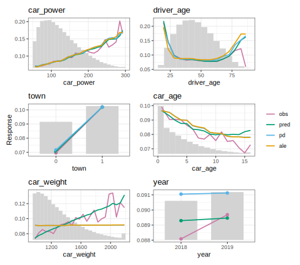

# marginalplot 

<!-- badges: start -->

[](https://github.com/mayer79/marginalplot/actions/workflows/R-CMD-check.yaml)
[](https://www.tidyverse.org/lifecycle/#experimental)
[](https://app.codecov.io/gh/mayer79/marginalplot)
<!-- badges: end -->

**{marginalplot}** provides high-quality plots for modeling.

Per feature and feature value, the main function `marginal()` calculates

- average observed response (and std),
- average predicted values (and std),
- partial dependence, and
- counts/weights.

The workflow is as follows:

1. Crunch values via `marginal()` or the convenience wrappers `average_observed()` and `partial_dependence()`.
2. Post-process the results with `postprocess()`, e.g., to collapse rare levels of categorical features.
3. Plot the results with `plot()`.

**Notes**

- You can switch between {ggplot2}/{patchwork} plots and interactive {plotly} plots.
- The implementation is optimized for large data.
- Most models (including DALEX explainers and meta-learners such as Tidymodels) work out-of-the box. If not, a tailored prediction function can be specified.
- For multi-output models, the last output is picked.
- Case weights are supported via the argument `w`.
- Binning of numeric features is done by the same options as `stats::hist()`. Additionally, outliers are capped (not removed) at +-2 IQR from the quartiles by default.

## Installation

You can install the development version of {marginalplot} from [GitHub](https://github.com/) with:

``` r
# install.packages("pak")
pak::pak("mayer79/marginalplot")
```

## Usage

We use synthetic data with 1 Mio rows containing information on Motor TPL insurance policies and claims.
The aim is to model claim frequency as a function of features like "driver_age" and "car_power".

Before modeling, we want to study how the average response is associated with feature values.

``` r
library(OpenML)
library(lightgbm)
library(marginalplot)

set.seed(1)

df <- getOMLDataSet(data.id = 45106L)$data

xvars <- c("year", "town", "driver_age", "car_weight", "car_power", "car_age")

# 0.3s on laptop
average_observed(df[xvars], y = df$claim_nb) |>
  postprocess(sort = TRUE) |> 
  plot(share_y = TRUE)
```


The plots have been automatically sorted by decreasing (weighted) variance of the average observed values. A shared y axis helps to compare the strength of the association across features.

### Fit model

Next, let's fit a boosted trees model.

```r
# Data splits
ix <- sample(nrow(df), 0.8 * nrow(df))
train <- df[ix, ]
test <- df[-ix, ]
X_train <- data.matrix(train[xvars])
X_test <- data.matrix(test[xvars])

# Training, using slightly opimized parameters found via cross-validation
params <- list(
  learning_rate = 0.05,
  objective = "poisson",
  num_leaves = 7,
  min_data_in_leaf = 50,
  min_sum_hessian_in_leaf = 0.001,
  colsample_bynode = 0.8,
  bagging_fraction = 0.8,
  lambda_l1 = 3,
  lambda_l2 = 5,
  num_threads = 7
)

fit <- lgb.train(
  params = params,
  data = lgb.Dataset(X_train, label = train$claim_nb),
  nrounds = 300
)
```

### Inspect model

After modeling, we use the test (or validation) data to crunch average observed, average predicted, and partial dependence per feature values/bins to gain insights about the model. Calculations are lightning fast.

```r
# 0.3s on laptop
marginal(fit, v = xvars, data = X_test, y = test$claim_nb) |>
  postprocess(sort = TRUE) |> 
  plot()
```



**Comments**

1. Comparing average predicted with average observed values gives a hint about bias. In this case, the bias on the test data seems to be small. Studying the same plot on the training data would help to assess in-sample bias.
2. Comparing the shape of the partial dependence curve with the shape of the average predicted curve provides additional insights. E.g., for the two strong predictors "driver_age" and "car_power", the two lines are very similar. This means the marginal effects are mainly due to the feature on the x-axis (and not of some other, correlated, feature).
3. Sorting is done by decreasing weighted variance of the partial dependence values, a measure of main-effect strength closely related (but not 100% identical) to [1].

# References

1. Greenwell, Brandon M., Bradley C. Boehmke, and Andrew J. McCarthy. 
*A Simple and Effective Model-Based Variable Importance Measure.* Arxiv (2018).

