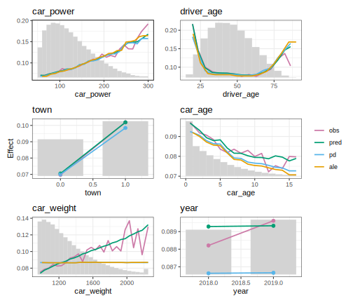
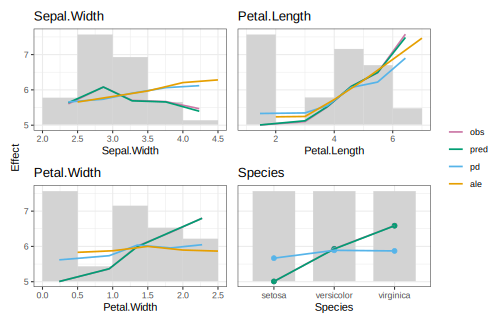

# effectplots 

<!-- badges: start -->

[](https://github.com/mayer79/effectplots/actions/workflows/R-CMD-check.yaml)
[](https://cran.r-project.org/package=effectplots)

<!-- badges: end -->

**{effectplots}** is a high-performance R package for calculating and plotting feature effects of any model.

The main function `feature_effects()` crunches the following statistics per feature X over values/bins:

- Average observed y values: Descriptive associations between response y and features.
- Average predictions: Combined effect of X and other features (M Plots, Apley [1]).
- Partial dependence (Friedman [2]): How does the average prediction react on X, keeping other features fixed.
- Accumulated local effects (Apley [1]): Alternative to partial dependence.

Furthermore, it calculates counts, average residuals, and standard deviations of observed y and residuals, eventually accounting for case weights. We highly recommend Christoph Molnar's book [3] for more info on feature effects.

**It takes 2 seconds on a laptop to get all statistics for ten features on a 10 Mio row data (+ prediction time).**

**Workflow**

1. **Crunch** values via `feature_effects()` or the little helpers `average_observed()`, `partial_dependence()` etc.
2. **Update** the results with `update()`: Combine rare levels of categorical features, sort results by importance etc.
3. **Plot** the results with `plot()`: Choose between ggplot2/patchwork and plotly.

## Installation

You can install the development version of {effectplots} from [GitHub](https://github.com/) with:

``` r
# install.packages("pak")
pak::pak("mayer79/effectplots", dependencies = TRUE)
```

## Usage

We use a 1 Mio row dataset about Motor TPL insurance. The aim is to model claim frequency. Before modeling, we want to study association between features and the response.

``` r
library(effectplots)
library(OpenML)
library(lightgbm)

set.seed(1)

df <- getOMLDataSet(data.id = 45106L)$data

xvars <- c("year", "town", "driver_age", "car_weight", "car_power", "car_age")

# 0.1s on laptop
average_observed(df[xvars], y = df$claim_nb) |>
  plot(share_y = "all")
```


A shared y axis helps to compare the strength of the association across features.

### Fit model

Next, let's fit a boosted trees model.

```r
ix <- sample(nrow(df), 0.8 * nrow(df))
train <- df[ix, ]
test <- df[-ix, ]
X_train <- data.matrix(train[xvars])
X_test <- data.matrix(test[xvars])

# Training, using slightly optimized parameters found via cross-validation
params <- list(
  learning_rate = 0.05,
  objective = "poisson",
  num_leaves = 7,
  min_data_in_leaf = 50,
  min_sum_hessian_in_leaf = 0.001,
  colsample_bynode = 0.8,
  bagging_fraction = 0.8,
  lambda_l1 = 3,
  lambda_l2 = 5,
  num_threads = 7
)

fit <- lgb.train(
  params = params,
  data = lgb.Dataset(X_train, label = train$claim_nb),
  nrounds = 300
)
```

### Inspect model

Let's crunch all statistics on the test data. Sorting is done by weighted variance of partial dependence, a main-effect importance measure closely related to [4].

The average predictions closely follow the average observed, i.e., the model does a good job. Comparing partial dependence/ALE with average predicted gives insights on whether an effect comes from the feature on the x axis or from other, correlated, features.

```r
# 0.3s on laptop
feature_effects(fit, v = xvars, data = X_test, y = test$claim_nb) |>
  update(sort_by = "pd") |> 
  plot()
```




### Flexibility

What about combining training and test results? Or comparing different models or subgroups? No problem:

```r
m_train <- feature_effects(fit, v = xvars, data = X_train, y = train$claim_nb)
m_test <- feature_effects(fit, v = xvars, data = X_test, y = test$claim_nb)

# Pick top 3 based on train
m_train <- m_train |> 
  update(sort_by = "pd") |> 
  head(3)
m_test <- m_test[names(m_train)]

# Concatenate train and test results and plot them
c(m_train, m_test) |> 
  plot(
    share_y = "rows",
    ncol = 2,
    byrow = FALSE,
    stats = c("y_mean", "pred_mean"),
    subplot_titles = FALSE,
    title = "Left: Train - Right: Test",
  )
```


In case we want to dig deeper into bias, we can use "resid_mean" as statistic, and show pointwise 95% confidence intervals for the true bias.

```r
c(m_train, m_test) |> 
  update(drop_below_n = 50) |> 
  plot(
    ylim = c(-0.06, 0.09),
    ncol = 2,
    byrow = FALSE,
    stats = "resid_mean",
    subplot_titles = FALSE,
    title = "Left: Train - Right: Test",
    interval = "ci"
  )
```


## DALEX and Tidymodels et al.

Most models work out-of-the box. If not, a tailored prediction function can be specified.

```r
library(DALEX)
library(ranger)

set.seed(1)

fit <- ranger(Sepal.Length ~ ., data = iris)
ex <- DALEX::explain(fit, data = iris[, -1], y = iris[, 1])

feature_effects(ex, breaks = 5) |> 
  plot(share_y = "all")
```




# References

1. Apley, Daniel W., and Jingyu Zhu. 2020. *Visualizing the Effects of Predictor Variables in Black Box Supervised Learning Models.* Journal of the Royal Statistical Society Series B: Statistical Methodology, 82 (4): 1059–1086. doi:10.1111/rssb.12377.
2. Friedman, Jerome H. 2001. *Greedy Function Approximation: A Gradient Boosting Machine.* Annals of Statistics 29 (5): 1189–1232. doi:10.1214/aos/1013203451.
3. Molnar, Christoph. 2019. *Interpretable Machine Learning: A Guide for
Making Black Box Models Explainable*. <https://christophm.github.io/interpretable-ml-book/>.
4. Greenwell, Brandon M., Bradley C. Boehmke, and Andrew J. McCarthy. 2018.
*A Simple and Effective Model-Based Variable Importance Measure.* arXiv preprint. <https://arxiv.org/abs/1805.04755>.

