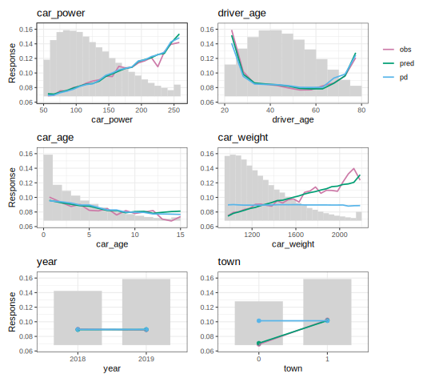
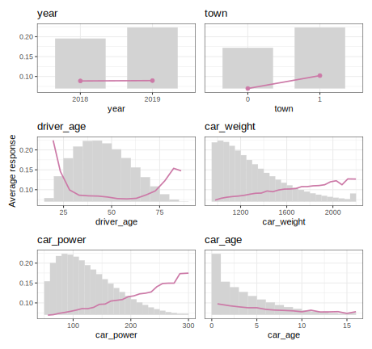

# marginalplot 

<!-- badges: start -->

[](https://github.com/mayer79/marginalplot/actions/workflows/R-CMD-check.yaml)
[](https://www.tidyverse.org/lifecycle/#experimental)
[](https://app.codecov.io/gh/mayer79/marginalplot)
<!-- badges: end -->

**{marginalplot}** provides high-quality plots for modeling.

Per feature and feature value, the main function `marginal()` calculates

- average observed values of the model response,
- average predicted values,
- partial dependence, and
- the exposure.

The workflow is as follows:

1. Crunch values via `marginal()` or the convenience wrappers `average_observed()` and `partial_dependence()`.
2. Post-process the results with `postprocess()`, e.g., to collapse rare levels of a categorical feature.
3. Plot the results with `plot()`.

**Notes**

- You can switch between {ggplot2}/{patchwork} plots and interactive {plotly} plots.
- The implementation is optimized for speed and convenience.
- Most models (including DALEX explainers and meta-learners such as Tidymodels) work out-of-the box. If not, a tailored prediction function can be specified.
- For multioutput models, the last output is picked.
- Case weights are supported via the argument `w`.
- Binning of numeric X is done by the same options as `stats::hist()`. Additionally, very small and large values are winsorized (clipped) by default.

## Installation

You can install the development version of {marginalplot} from [GitHub](https://github.com/) with:

``` r
# install.packages("pak")
pak::pak("mayer79/marginalplot")
```

## Usage

``` r
library(marginalplot)
library(ranger)

set.seed(1)

fit <- ranger(Sepal.Length ~ ., data = iris)
xvars <- c("Sepal.Width", "Petal.Width", "Petal.Length", "Species")

marginal(fit, v = xvars, data = iris, y = "Sepal.Length") |> 
  plot()
```



## More examples

### Partial dependence only

The function `partial_dependence()` produces high-quality plots to study main effects. To visually see how important each feature is (regarding main effect strength), we switch on the option `share_y` and sort the plots by decreasing variance of the partial dependence function (exposure weighted).

``` r
library(marginalplot)
library(ranger)

set.seed(1)

fit <- ranger(Sepal.Length ~ ., data = iris)
xvars <- colnames(iris)[-1]

partial_dependence(fit, v = xvars, data = iris, breaks = 17) |> 
  plot(sort = TRUE, share_y = TRUE, scale_exposure = 0.2)
```


### Before modeling

Before modeling, you might be interested in

- univariate distributions of potential features, and
- how the average response is associated with their values.

These infos are provided via `average_observed()`.

Note: Sorting is done by decreasing variance of average observed values (exposure weighted).

``` r
library(marginalplot)

xvars <- colnames(iris)[-1]
average_observed(xvars, data = iris, y = "Sepal.Length") |> 
  plot(sort = TRUE, share_y = TRUE, rotate_x = 45)
```


